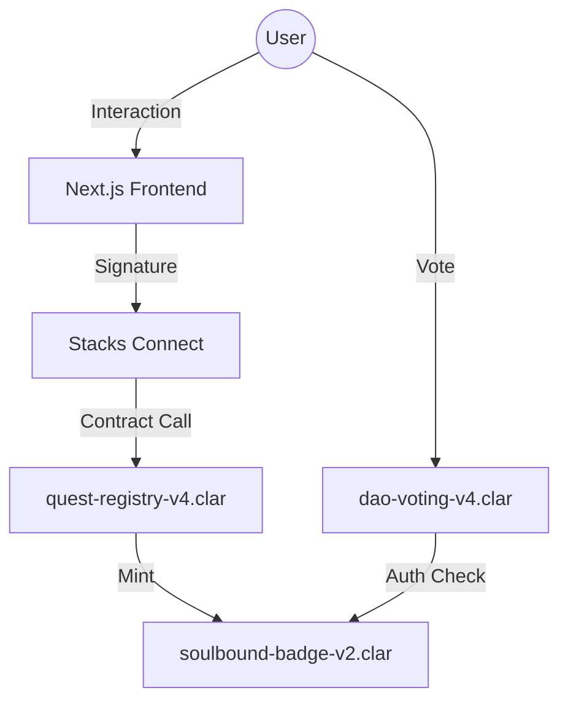

# QuestDAO 🏛️✨

**The Premier Educational Protocol for Bitcoin Layer-2 Architects.**

QuestDAO is a decentralized education protocol on Stacks where developers master Clarity, earn Soulbound reputation badges, and govern the future of the guild.

**Read our [Manifesto](file:///Users/psyhodivka/Projects/Stacks/QuestDAO/MANIFESTO.md) // Build for Truth. Architect for Eternity.**

---

## 🚀 Vision: Proof of Knowledge
In the burgeoning Bitcoin economy, technical expertise is the scarcest resource. QuestDAO transforms documentation into a gamified protocol where:
1.  **Learners** prove their mastery by interacting with real smart contracts.
2.  **Architects** earn status that translates into governance power.
3.  **The DAO** evolves based on the collective wisdom of its most certified members.

---

## 🏗️ Architecture

QuestDAO is a vertically integrated Stacks application:



### Core Smart Contracts
- **`quest-registry-v4.clar`**: The central brain. Manages the curriculum, tracks user progress, and authorizes badge minting.
- **`soulbound-badge-v2.clar`**: An extension of SIP-009. These NFTs are burned if transferred, ensuring reputation is earned, not bought.
- **`dao-voting-v4.clar`**: The governance engine. Allows badge-holders to propose and vote on the future of the protocol.

---

## 🛠️ Technology Stack
- **Smart Contracts**: Clarity (Stacks L1/L2)
- **Frontend**: Next.js 15 (App Router), Tailwind CSS v4
- **Web3 Integration**: `@stacks/connect`, `@stacks/transactions`, Hiro API
- **Visuals**: WebGL Shaders (Three.js), Stacks Vibrant Design System

---

## 🚦 Getting Started

### Prerequisites
- [Clarinet](https://github.com/hirosystems/clarinet) (for smart contract development)
- [Node.js](https://nodejs.org/) (for the frontend)
- [Leather Wallet](https://www.leather.io/) or [Xverse](https://www.xverse.app/)

### Smart Contract Development
1. Clone the repo:
   ```bash
   git clone https://github.com/your-username/QuestDAO.git
   cd QuestDAO
   ```
2. Run tests:
   ```bash
   clarinet test
   ```
3. Check contract integrity:
   ```bash
   clarinet check
   ```

### Web Dashboard
1. Navigate to the frontend:
   ```bash
   cd frontend
   ```
2. Install dependencies:
   ```bash
   npm install
   ```
3. Start the development server:
   ```bash
   npm run dev
   ```

---

## 🏛️ Governance
QuestDAO is governed by its users. To participate:
1. Complete the **Clarity Fundamentals** quest.
2. Receive your **Architect Level 1** Soulbound Badge.
3. Visit the **Council** page to view and vote on active proposals.

---

## 📜 License
Distributed under the MIT License. See `LICENSE` for more information.

---

## 👋 Contributing
Contributions are what make the open source community such an amazing place to learn, inspire, and create. Any contributions you make are **greatly appreciated**.

1. Fork the Project
2. Create your Feature Branch (`git checkout -b feature/AmazingFeature`)
3. Commit your Changes (`git commit -m 'Add some AmazingFeature'`)
4. Push to the Branch (`git push origin feature/AmazingFeature`)
5. Open a Pull Request

---

*Built with ❤️ by the QuestDAO Architects.*
